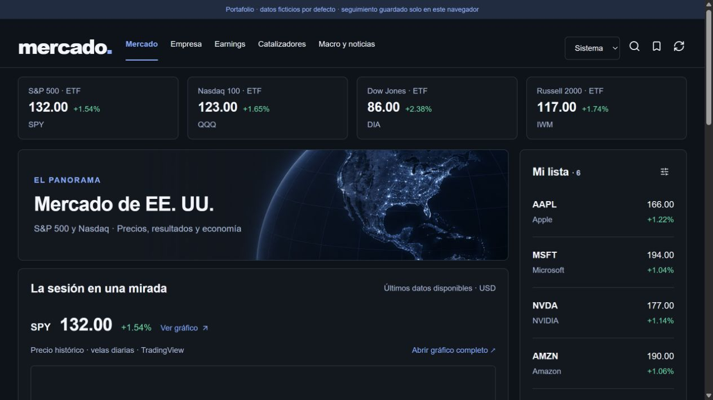

# Mercado

Terminal personal de investigación de acciones: mercado, ficha de empresa, ratios, earnings, noticias y seguimiento de catalizadores.



## Qué muestra

- Interfaz en React y TypeScript con temas claro, oscuro y sistema.
- Búsqueda de tickers, gráficos, lista de seguimiento y registro de hipótesis.
- API de mercado con caché temporal y errores por sección.
- Integración opcional con Finnhub; gráficos externos de TradingView.

## Probar

Requiere Node.js 22.13 o superior.

```bash
npm install -g pnpm@11.19.0
pnpm install --frozen-lockfile
pnpm dev
```

Abre http://localhost:3000. Por defecto usa cotizaciones, perfiles, noticias y earnings ficticios para que la interfaz pueda explorarse sin credenciales. No representan información financiera actual. Los widgets externos de TradingView pueden mostrar datos reales y requieren conexión a Internet.

La lista de seguimiento y los catalizadores se guardan solo en el almacenamiento de tu navegador; esta edición no incluye cuentas ni el almacenamiento privado del sitio original.

Para usar el proveedor real, copia `.env.example` a `.env.local`, configura tu propia clave de Finnhub y cambia `MARKET_DATA_MODE=live`. La cobertura depende de tu plan. No incluyas claves en commits.

## Verificar

```bash
pnpm typecheck
pnpm build
```

## Alcance y autoría

Proyecto personal de Luka, desarrollado e iterado con asistencia de IA. Esta edición adapta el producto a ejecución local y sustituye la infraestructura y cualquier dato de cuenta por un modo demostración. Los activos de terceros conservan sus avisos de licencia en `vendor/`.
